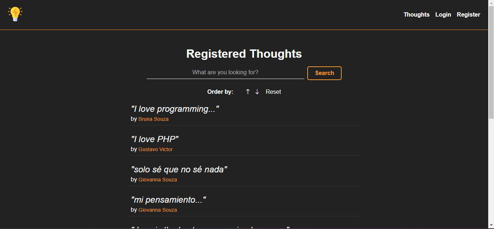

<h1 align='center'>Thoughts 💭</h1>

<p align="center">
  <a href="#-sobre">Sobre</a>&nbsp;&nbsp;&nbsp;|&nbsp;&nbsp;&nbsp;
  <a href="#-layout">Layout</a>&nbsp;&nbsp;&nbsp;|&nbsp;&nbsp;&nbsp;
  <a href="#-funcionalidades">Funcionalidades</a>&nbsp;&nbsp;&nbsp;|&nbsp;&nbsp;&nbsp;
  <a href="#-tecnologias-e-ferramentas">Tecnologias e Ferramentas</a>&nbsp;&nbsp;&nbsp;|&nbsp;&nbsp;&nbsp;
  <a href="#-como-usar">Como usar</a>&nbsp;&nbsp;&nbsp;|&nbsp;&nbsp;&nbsp;
  <a href="#-licença">Licença</a>&nbsp;&nbsp;&nbsp;|&nbsp;&nbsp;&nbsp;
</p>

<p align="center">
    ✔ Projeto concluído
</p>

<hr/>


## ❓ Sobre

Este projeto é uma aplicação web que permite ao usuário gerenciar e compartilhar seus pensamentos sobre qualquer assunto. 

Projeto baseado no curso de Node.js da empresa ['Hora de Codar'](https://horadecodar.com.br/). 

Clique [aqui](https://thoughts-7avl.onrender.com) para conferir como ficou a aplicação hospedada na plataforma [Render](https://render.com/).  


## 🎨 Layout




## ⚙️ Funcionalidades

- [x] Cadastro de usuários
- [x] Login de usuários
- [x] Gerenciamento de pefil de usuários
- [x] Gerenciamento de pensamentos de usuários
- [x] Listagem de pensamentos de usuários com filtros


## 🛠 Tecnologias e Ferramentas

- [HTML5](https://developer.mozilla.org/pt-BR/docs/Web/HTML)
- [CSS](https://developer.mozilla.org/pt-BR/docs/Web/CSS)
- [JavaScript](https://developer.mozilla.org/pt-BR/docs/Web/JavaScript)
- [Node.js](https://nodejs.org/docs/latest/api/)
- [BcryptJS](https://www.npmjs.com/package/bcryptjs)
- [PostgreSQL](https://www.postgresql.org/)
- [Sequelize](https://www.npmjs.com/package/sequelize)
- [Express](https://www.npmjs.com/package/express)
- [Handlebars](https://www.npmjs.com/package/express-handlebars)

Veja como ficou o arquivo [package.json](./package.json)


## 💻 Como usar

Antes de continuar, é recomendado possuir alguns conhecimentos básicos de [HTML5](https://developer.mozilla.org/pt-BR/docs/Web/HTML), [CSS3](https://developer.mozilla.org/pt-BR/docs/Web/HTML), [JavaScript](https://www.javascript.com/) e [Node.js](https://nodejs.org/docs/latest/api/) para entender os códigos do projeto. 
Além disso, você precisa ter instalado em sua máquina o [GIT](https://git-scm.com/), [Node](https://nodejs.org/en) e um **editor de texto** de sua preferência. Recomendo sempre o [Visual Studio Code](https://code.visualstudio.com/). 

Um guia básico sobre como instalar e executar o projeto no modo de desenvolvimento na sua máquina local: 

1. Clone o projeto ou faça download do ZIP: 

```bash
    # abra o terminal (Git bash) e digite 
    # não precisa fazer isso se já tiver feito download do projeto (nesse caso, só extraia a pasta e entre nela)
    $ git clone https://github.com/Gustavo-Victor/thoughts.git
```

2. Entre na pasta do projeto:

```bash
    $ cd thoughts/
```

3. Instale as dependências:

```bash
    $ npm install
```

4. Execute a aplicação:

```bash
    $ npm start
```

5. Abra o projeto no seu navegador de preferência:
    - Digite no seu navegador o URL: http://localhost:3000/

<hr/>


## 📝 Licença 

O projeto está sob a Licensa MIT 

Qualquer pessoa pode usar, clonar e contribuir com este projeto. 

Clique [aqui](./LICENSE) para saber mais  


